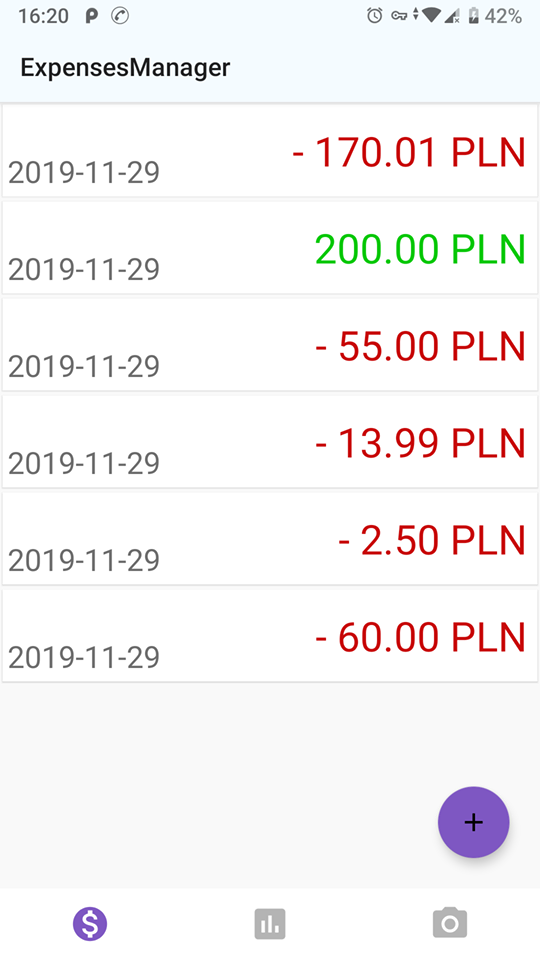
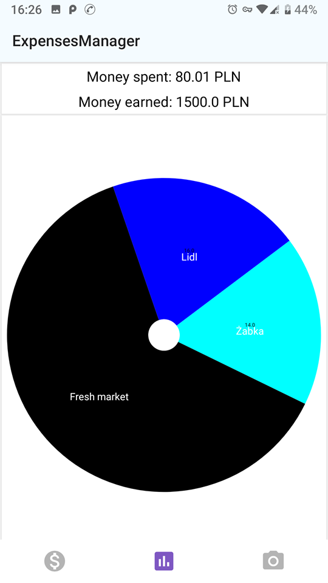

# ExpensesManager 🧾

Application for tracking your expenses and income. It features recipt scanner using device's camera. 

Data is stored locally with the help of Room Persistance Library. For displaying charts I used MPAndroidchart and ML Kit for text recognition.

## Screenshots 

  

